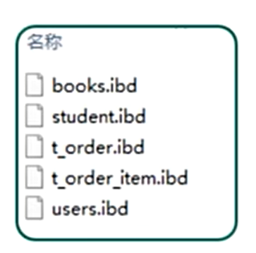

# 概念

## 引入

程序中数据库的概念

方法一、程序运行变量

```Java
public String name;
```

缺点，只在运行时存放，在程序终止时会被立即释放，不会把变量存储到本地磁盘中，易产生数据丢失问题

方法二、

I/O流，本地文件存储

本地文本文件无格式，若对整个文本进行增删改查操作可以实现，但是对文本局部进行条件化的增删改查操作复杂，可持久存储，但不方便进行操作

方法三、

持久手段，数据库存储。

## 概念

### 程序中“数据库”概念

1、数据库是“按照数据结构来组织，存储和管理数据的仓库”。

2、是一个长期存储在计算机内的、有组织的、可共享的、统一管理的、大量数据的集合文件。数据库的具体体现，就是磁盘的文件或内存的一段数据。

①数据库中数据存储是有组织的结构，方便数据读取和修改等



②一种长期存储手段，不主动删除数据不应该消失


③数据库中数据存储是有组织的结构，方便数据读取何修

④数据库数据属于可共享的符合真正开发需求

### 数据库分类

①非关系型数据库

    非关系数据库并没有统一存储结构标准，现常见结构有键值、文档、JSON类型等，对高兴呢个需求设计。

    高性能读写：少关系型，注重高性能读写能力，适用于大规模数据并发访问模型

    无固定的表结构：不需要预定义的表结构，时应非结构化或者板结构化数据。

    灵活的数据模型：支持多种数据模型，例如键值对，文档型，列族型和图形数据库。

②关系型数据库

    数据按照类别进行存储，每个剋别存储到一个容器（表）中，表和表之间可以建立关系，可以仅从关联操作，性能相对一般。

    结构化数据模型：数据以表格形式存储，具有固定的结构。例如：学生和分数分别存储到不同的表。（前置操作）

    ACID事务：通过强大的事务支持，保证数据的原子性、一致性、隔离性和持久性。例如：转账失败，钱不损失。（数据回滚）

    丰富查询语句：支持SQL语言，能够进行复杂的关联数据查询。例如：查询学生以及学生分数。

    数据一致性：数据的关系和约束确保数据的一致性和完整型。例如：存储学生数据，保证身份证号唯一且不为空

**特点总结**

关系型数据库适用于需要强一致性和复杂查询的场景

非关系型数据库适用于需要高性能、灵活和分布式处理的场景

### 数据库的选择

开发中类型那种数据库多一些呢？

数据库选择总结：

1、绝大部分采用混合模式，二者结合使用

2、数据主体一般存储在关系型数据库(主)

3、程序缓存数据和高并发数据存储到非关系类型数据库(辅)

4、本笔记仅展示关系型数据库

### 关系型数据库存储设计规则(E-R模型)

    ·遵循ER模型

    ·  E(Entity)代表实体类别，关系型数据库中一类数据，对应数据库中的一张'表'储存

    ·  R(Relationship)'表'和'表'可以维护某种'关系'，可以通过'关系'进行多表操作

    ·模型解释

    ·  数据库中的最大存储单位为'**库**'

    ·  每类数据存储一张'**表**'中,表储存到'**库**'中

    ·  '**表**'具有一些特性'**列**',这些特性'**列**'定义数据在表中如何存储

    ·  '**表**'中的数据式按照'**行**'存储,一'**行**'即为一条记录

    ·  对比总结

| 单位名称 | 描述                              | 对比     |
| -------- | --------------------------------- | -------- |
| 库       | 数据库中最大的存储单位,内部储存表 |          |
| 表       | 一类数据和实体的集合              | Java类   |
| 行       | 一行数据,一个实体,操作最基本单位  | Java对象 |
| 列       | 最小存储单位,代表一个属性         | 对象属性 |


知识点小结

1、理解数据库作用、概念、以及数据库（长期、有格式、可以共享）特点！

2、数据库分类（关系型和非关系型）、以及每类的特点！

3、关系型数据库（E-R模型）、以及存储单位（库表行列）！

# 数据库管理系统概述

## 概述


数据库管理系统(DataBase Management System DBMS)

    指一种操作和管理数据库的大型软件，用户通过数据库管理系统操作数据库中的数据

## 常见关系型数据库管理系统有哪些


## 数据库管理系统(MySQL)安装

下载

地址:

[MySQL :: MySQL Community Downloads](https://dev.mysql.com/downloads/)

# 结构化查询语句(SQL)概述

如何触发MySQL软件进行数据库操作呢？


SQL:Structure Query Language(结构化查询语句)

SQL被美国国家标准局(ANSI)确定为关系型数据库语言的美国标准，后来被国际化标准组织(ISO)采纳为关系数据库语言的国际标准，可以使用SQL命令进行关系型数据库操作


提示：

    所有关系型数据库都支持'标准SQL'语句

    但是也会有特定的'方言SQL'语句

    本笔记金展示标准SQL语句和MySQL方言

## 语句分类

SQL包括了所有对数据库的操作，主要是由数据定义、数据操纵、数据查询、数据控制、事务控制等SQL语言的使用规定组成


介绍SQL输入位置和基本命令:包括连接、退出、版本查询、以及注释等。

先打开cmd命令窗口

链接mqsql服务命令

```SQL
登陆用户名>mysql -u<username> -p<password> -h<hostname>
<databasename>
注意：参数部分先后顺序
```

解释一下这些参数的含义：

-u`<username>`:用于指定你要连接的 MySOL数据库的用户名

-p`<password>`:表示密码，后面紧跟着密码，中间没有空格。如果你不希望在命令行中显示密码，可以不指定密码，直接-p，然后在提示下手动输入密码。

-h`<hostname>`:用于指定 MySQL服务器的主机名或者 IP 地址。如果 MySQL 在本地运行，可以用 localhost.P`<port>`:用于指定连接 MySOL服务器的端口号，默认情况下是 3306。

`<databasename>`:是你要连接的数据库的名称。连接后会默认使用这个数据库

其他基础SQL命令

SQL注释：

单行注释：#注释内容

单行注释：--注释内容        其中--后面的空格必须有

多行注释：/*    注释内容     *

版本和退出控制

```SQL
-- 查看版本，命令符号之间空格隔开，每条命令后使用，结束，否则不执行，切记！！！
mysql> select version();
-- 直接退出
mysql> exlt;  -- 可以不加分号·
```

## 知识小结

    1、理解结构化查询语句的作用

    2、掌握结构化查询语句的分类，理解学习步骤

    3、掌握基本的链接、断开、以及注释等基本的SQL语法

# 可视化工具选择和安装

这边提供navicat的安装与激活方法

16.0、16.1直接激活

压缩包下载：https://www.lanzouw.com/iOSaJ1wyaihi

Step1：断网

Step2：安装Navicat16.1

Step3：以管理员身份运行 NavicatCracker.exe 生成序列号

Step4：使用序列号得到请求码

Step5：使用请求码生成激活码并激活Navicat
